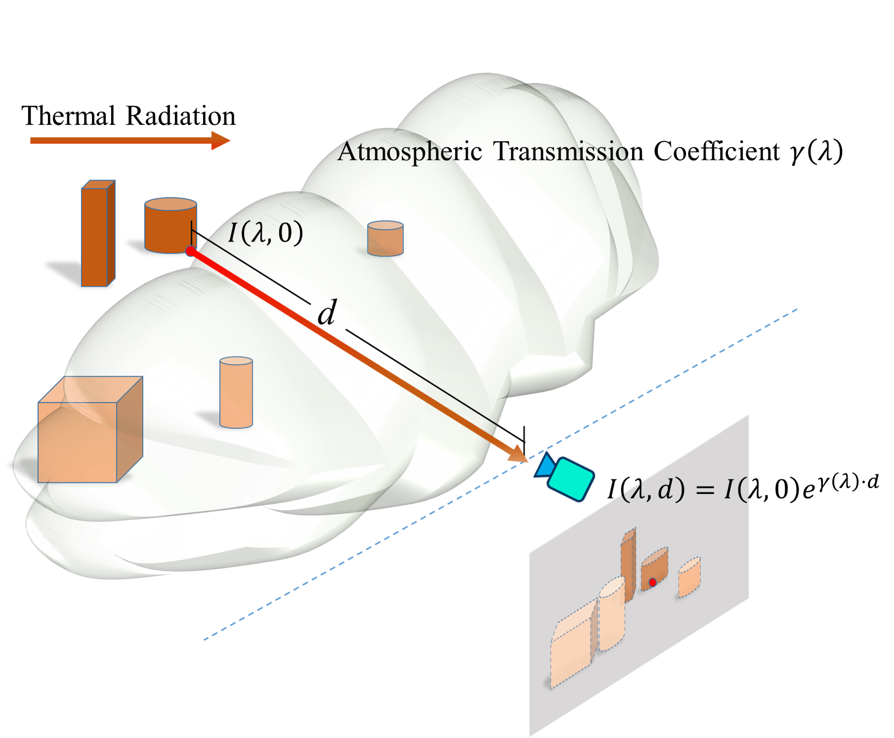
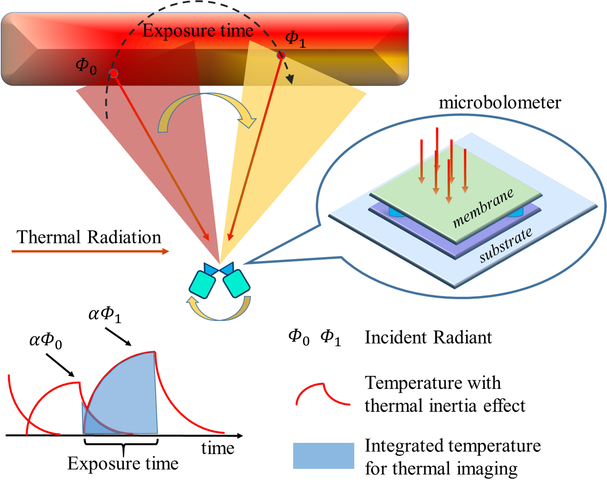

Official implementation of the paper "Atmospheric Transmission and Thermal Inertia Induced Blind Road Segmentation with a Large-Scale Dataset TBRSD"
=
Framework of our method
-

 

Overview of (a) TINN and the two key blocks: (b) the Atmospheric Transmission Module(ATM) module and (c) the Thermal Inertia Module(TIM). Here the $\gamma_{abs}, \gamma_{sca}, d, C_{th}, G_{th}, t_{0}, t_{e}, \alpha, \Phi_{0}$ and $\tau$ are all trainable parameters. All operations in ATM and TIM are processed on a pixel-to-pixel basis.

 

Attenuation of thermal infrared light traveled through the air is primarily composed of absorption and scattering. The transmission is exponentially decreased by the distance $d$ between the object to the camera.

 

The thermal microbolometer detects incident radiation by measuring the electrical resistance. The incident radiation is captured by the membrane of the microbolometer. A change in electrical resistance between the membrane and the substrate determines the recorded intensity, which in turn is used to generate the final thermal image. This process is impacted by the thermal inertia effect of the microbolometer. This effect can be modeled by parameterizing the thermal conductivity, thermal capacitance and the absorptivity of the microbolometer.

Dataset
-
The dataset can be download in http://xzbai.buaa.edu.cn/datasets.html

 

Usage
-
