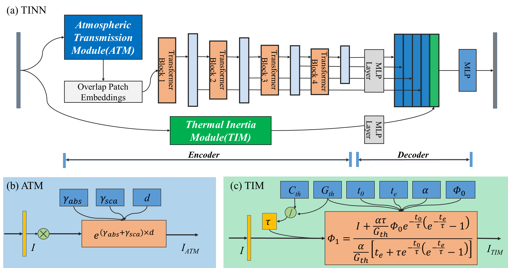
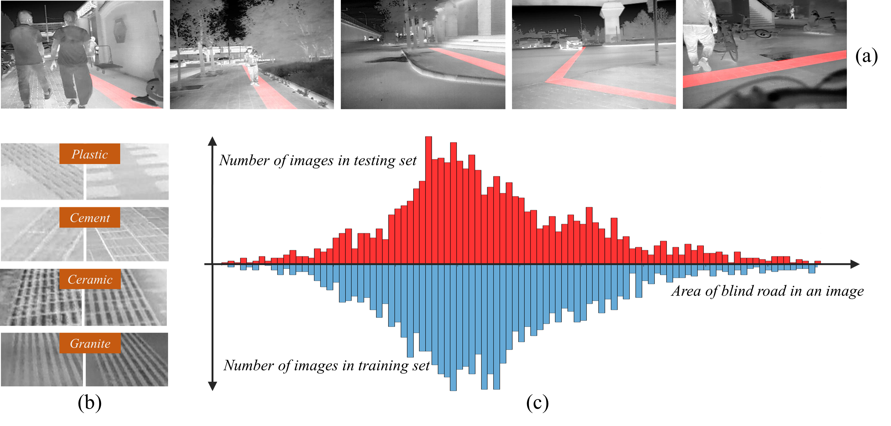

# Official implementation of the paper "Atmospheric Transmission and Thermal Inertia Induced Blind Road Segmentation with a Large-Scale Dataset TBRSD"

## Framework of our method

<br/>

Overview of (a) TINN and the two key blocks: (b) the Atmospheric Transmission Module (ATM) and (c) the Thermal Inertia Module (TIM). Here the $\gamma_{abs}, \gamma_{sca}, d, C_{th}, G_{th}, t_{0}, t_{e}, \alpha, \Phi_{0}$ and $\tau$ are all trainable parameters. All operations in ATM and TIM are processed on a pixel-to-pixel basis.

## Dataset

The dataset can be downloaded at [this link](http://xzbai.buaa.edu.cn/datasets.html).

<br/>

## Environment Setup

To set up the environment, follow the steps below. Please choose the appropriate versions of CUDA and PyTorch based on your system configuration. In this example, the environment is configured with **CUDA 10.1** and **PyTorch 1.7.1**.

1. Install the required packages:
    ```bash
    pip install torchvision==0.8.2
    pip install timm==0.3.2
    pip install mmcv-full==1.2.7
    pip install opencv-python==4.5.1.48
    pip install ipython attr
    ```

2. Install the project in editable mode:
    ```bash
    pip install -v -e .
    ```

## Usage
### Pretrained Weights
Please download the pretrained model [mit_b5.pth](https://connecthkuhk-my.sharepoint.com/personal/xieenze_connect_hku_hk/_layouts/15/onedrive.aspx?id=%2Fpersonal%2Fxieenze%5Fconnect%5Fhku%5Fhk%2FDocuments%2Fsegformer%2Fpretrained%5Fmodels&ga=1) from the provided link and place it in the pretrained folder.
### Training

To train the model, use the following command:

```bash
python tools/train.py ${CONFIG_FILE} [optional arguments]
```

Example:
```bash
python tools/train.py configs/TINN/TINN.b5.512x512.TBRSD.240k.py
```

### Testing

To test the model, use the following command:
```bash
python tools/test.py ${CONFIG_FILE} ${CHECKPOINT_FILE}
```

Example：
```bash
python tools/test.py configs/TINN/TINN.b5.512x512.TBRSD.240k.py work_dirs/TINN.b5.512x512.TBRSD.240k/iter_240000.pth
```
